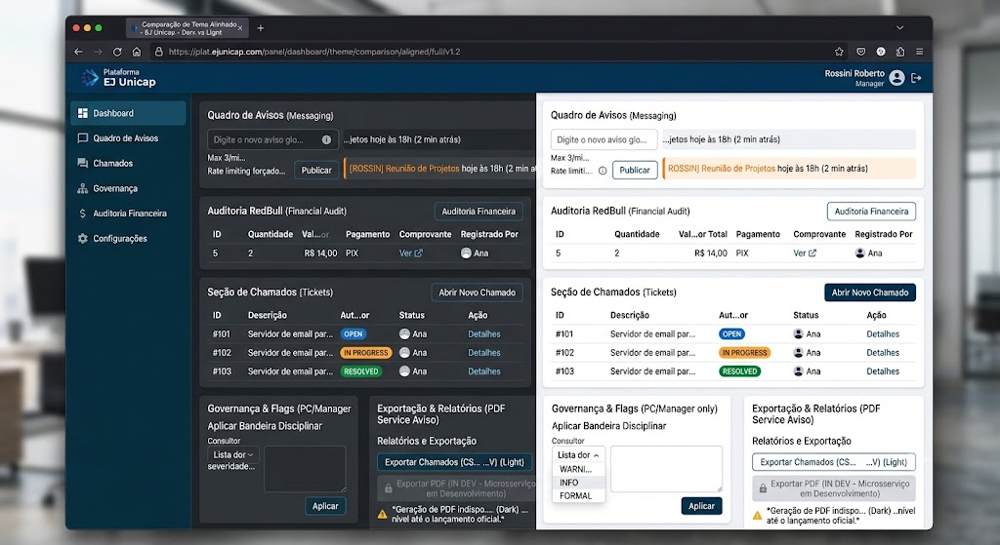

 # Documentação de Integração da API – Mensagens e Chamados

Este documento cobre apenas as rotas de `/messages` e `/tickets`.

---

## 📢 1. Quadro de Avisos / Mensageria (`/messages`)

POST /messages/
- Headers: `Authorization: Bearer <access_token>`
- Rate limit: máximo de 3 publicações por minuto por usuário/IP.
- Payload (JSON):
```json
{ "content": "Aviso geral: ..." }
```
- Validação: content mínimo 1 caractere, máximo 1500.
- Resposta (201):
```json
{
  "id": 42,
  "content": "Aviso geral: ...",
  "created_at": "2026-06-10T09:30:00Z",
  "user_id": 1
}
```

GET /messages/
- Paginação obrigatória via query params: `limit` (default 20, max 50) e `offset` (default 0).

---

## 🎫 2. Sistema de Chamados Formais (`/tickets`)

POST /tickets/
- Payload (JSON):
```json
{ "content": "...", "author_id": 1 }
```
- Resposta (201):
```json
{
  "id": 101,
  "author_id": 1,
  "assigned_to_id": null,
  "description": "...",
  "status": "OPEN",
  "created_at": "2026-06-10T09:32:00Z"
}
```
- Status: OPEN, IN_PROGRESS, RESOLVED.

---

## 🛡️ Tratamento Padrão de Erros Relevantes

- 400 Bad Request: payload malformado ou limite de caracteres.
- 401 Unauthorized: token ausente/expirado/assinado incorretamente.
- 403 Forbidden: falta de permissão.
- 422 Unprocessable: erro de validação do Pydantic V2.
- 429 Too Many Requests: limite de requisições atingido.

---

Observação: este documento é específico para mensagens e chamados; não inclui rotas de PDF, users/flags ou sales **(IN/DEV)**.

---
## Imagens para se basear na criacao das telas(FRONT-END)
(não usar esta imagem como referência absoluta! apenas referência de botões e etc)


